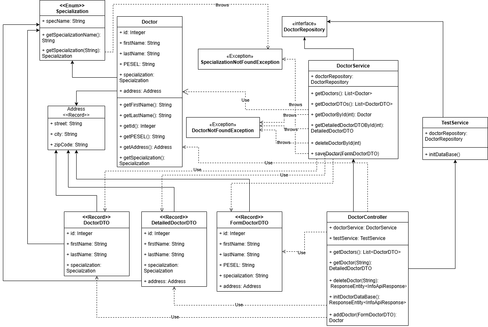

# System Zarządzania Lekarzami NFZ - Instrukcja Obsługi UI

## Spis treści

1. [Uruchomienie aplikacji](#uruchomienie-aplikacji)
2. [Interfejs użytkownika](#interfejs-użytkownika)
3. [Funkcjonalności](#funkcjonalności)
    - [Przeglądanie listy lekarzy](#1-przeglądanie-listy-lekarzy)
    - [Dodawanie lekarza](#2-dodawanie-lekarza)
    - [Wyświetlanie szczegółów lekarza](#3-wyświetlanie-szczegółów-lekarza)
    - [Usuwanie lekarza](#4-usuwanie-lekarza)
    - [Inicjalizacja bazy danych](#5-inicjalizacja-bazy-danych)
    - [Odświeżanie listy](#6-odświeżanie-listy)
4. [Diagramy UML](#diagramy-uml)

---

## Uruchomienie aplikacji

### Wymagania

- Java 17 lub nowsza
- Gradle (zawarty w projekcie jako wrapper)

### Kroki uruchomienia

1. **Otwórz terminal** w katalogu głównym projektu

2. **Uruchom backend Spring Boot:**

   ```bash
   ./gradlew bootRun
   ```

   Na Windows:

   ```cmd
   gradlew.bat bootRun
   ```

3. **Otwórz przeglądarkę** i przejdź pod jeden z adresów:

   - **Lekarze:** `http://localhost:8080/index.html` lub `http://localhost:8080/test.html`
   - **Gabinety:** `http://localhost:8080/offices.html`
   - **Dyżury:** `http://localhost:8080/schedules.html`

4. Interfejs użytkownika powinien się załadować automatycznie.

---

## Interfejs użytkownika

Po uruchomieniu aplikacji zobaczysz stronę główną z:

- **Nagłówkiem** z nazwą systemu
- **Przyciskami akcji** (Dodaj Lekarza, Odśwież Listę, Inicjalizuj Bazę Danych)
- **Tabelą** z listą lekarzy

---

## Funkcjonalności

### 1. Przeglądanie listy lekarzy

**Opis:** Lista wszystkich lekarzy w systemie wyświetla się automatycznie po załadowaniu strony.

**Jak użyć:**

- Lista lekarzy wyświetla się w tabeli na stronie głównej
- Dla każdego lekarza widoczne są: ID, Imię, Nazwisko, Specjalizacja oraz przyciski akcji

---

### 2. Dodawanie lekarza

**Opis:** Funkcja umożliwia dodanie nowego lekarza do bazy danych.

**Jak użyć:**

1. **Kliknij przycisk** `Dodaj Lekarza` znajdujący się na górze strony

2. **Wyświetli się formularz** z polami do wypełnienia

3. **Wypełnij formularz** przykładowymi danymi:

   - Imię: `Jan`
   - Nazwisko: `Kowalski`
   - PESEL: `90010112345`
   - Specjalizacja: `Pediatria`
   - Ulica: `Słoneczna 15`
   - Miasto: `Warszawa`
   - Kod pocztowy: `00-001`

4. **Kliknij przycisk** `Dodaj Lekarza`

5. **Rezultat:**
   - Formularz zostanie zamknięty
   - Wyświetli się zielony komunikat: "Lekarz został pomyślnie dodany!"
   - Nowy lekarz pojawi się na liście

---

### 3. Wyświetlanie szczegółów lekarza

**Opis:** Funkcja umożliwia wyświetlenie pełnych informacji o wybranym lekarzu, włącznie z danymi adresowymi i dyżurami.

**Jak użyć:**

1. **Znajdź lekarza** na liście, którego szczegóły chcesz zobaczyć

2. **Kliknij przycisk** `Szczegóły` przy wybranym lekarzu

3. **Wyświetli się okno** ze szczegółowymi informacjami

4. **Kliknij** `Zamknij` lub obszar poza oknem, aby zamknąć szczegóły

---

### 4. Usuwanie lekarza

**Opis:** Funkcja umożliwia usunięcie lekarza z bazy danych.

**Jak użyć:**

1. **Znajdź lekarza** na liście, którego chcesz usunąć

2. **Kliknij przycisk** `Usuń` przy wybranym lekarzu

3. **Wyświetli się okno potwierdzenia**

4. **Kliknij** `Usuń` aby potwierdzić usunięcie, lub `Anuluj` aby anulować

5. **Rezultat:**
   - Jeżeli lekarz jest przypisany do jakiegoś dyżuru, wyświetli się komunikat o błędzie
   - Wyświetli się zielony komunikat: "Lekarz został pomyślnie usunięty!"
   - Lekarz zniknie z listy

---

### 5. Przeglądanie listy gabinetów

**Opis:** Lista wszystkich gabinetów w systemie wyświetla się automatycznie po załadowaniu strony.

**Jak użyć:**

- Lista gabinetów wyświetla się w tabeli na stronie gabinetów
- Dla każdego gabinetu widoczne są: ID, numer pokoju oraz przyciski akcji

---

### 6. Dodawanie gabinetu

**Opis:** Funkcja umożliwia dodanie nowego gabinetu do bazy danych.

**Jak użyć:**

1. **Kliknij przycisk** `Dodaj Gabinet` znajdujący się na górze strony

2. **Wyświetli się formularz** z polem do wypełnienia

3. **Wypełnij formularz** przykładowymi danymi:

    - Numer Pokoju: `67`


4. **Kliknij przycisk** `Dodaj Gabinet`

5. **Rezultat:**
    - Formularz zostanie zamknięty
    - Jeżeli gabinet o danym numerze pokoju juz istnieje, wyświetli się komunikat o błedzie
    - Wyświetli się zielony komunikat: "Gabinet został pomyślnie dodany!"
    - Nowy gabinet pojawi się na liście

---

### 7. Wyświetlanie szczegółów lekarza

**Opis:** Funkcja umożliwia wyświetlenie pełnych informacji o gabinecie lekarzu, włącznie z obowiązującymi dyżurami.

**Jak użyć:**

1. **Znajdź gabinet** na liście, którego szczegóły chcesz zobaczyć

2. **Kliknij przycisk** `Szczegóły` przy wybranym gabinecie

3. **Wyświetli się okno** ze szczegółowymi informacjami

4. **Kliknij** `Zamknij` lub obszar poza oknem, aby zamknąć szczegóły

---
### 8. Usuwanie gabinetu

**Opis:** Funkcja umożliwia usunięcie gabinetu z bazy danych.

**Jak użyć:**

1. **Znajdź gabinet** na liście, którego chcesz usunąć

2. **Kliknij przycisk** `Usuń` przy wybranym gabinecie

3. **Wyświetli się okno potwierdzenia**

4. **Kliknij** `Usuń` aby potwierdzić usunięcie, lub `Anuluj` aby anulować

5. **Rezultat:**
    - Jeżeli gabinet jest przypisany do jakiegoś dyżuru, wyświetli się komunikat o błędzie
    - Wyświetli się zielony komunikat: "Gabinet został pomyślnie usunięty!"
    - Gabinet zniknie z listy

---

### 9. Przeglądanie listy dyżurów

**Opis:** Lista wszystkich dyżurów w systemie wyświetla się automatycznie po załadowaniu strony.

**Jak użyć:**

- Lista dyżurów wyświetla się w tabeli na stronie dyżurów
- Dla każdego dyżuru widoczne są: ID, ID lekarza, ID gabinetu, godziny dyżuru oraz przyciski akcji

---

### 10. Dodawanie dyżuru

**Opis:** Funkcja umożliwia dodanie nowego dyżuru do bazy danych.

**Jak użyć:**

1. **Kliknij przycisk** `Dodaj Dyżur` znajdujący się na górze strony

2. **Wyświetli się formularz** z polami do wypełnienia

3. **Wypełnij formularz** przykładowymi danymi:

    - Godzina rozpoczęcia: `11:30:00`
    - Godzina zakończenia: `14:45:00`

4. **Kliknij przycisk** `Dodaj - Szukaj Wolnych`

5. **Pojawi się formularz** z listami dostepnych lekarzy i gabentów w tych godzinach

6. **Wybierz lekarza i gabient** z list

7. **Kliknij przycisk** `Zapisz dyżur`

5. **Rezultat:**
    - Formularz zostanie zamknięty
    - Jeżeli dyżur konfliktuje się z godzinami otwarcia kliniki (7:00-18:00) lub będzie on za krótki (min. 1 godzina), wyświetli się komunikat o błędzie
    - Jeżeli dyżur styka się czasowo z innym dyżurem, to jeżeli oba mają ten sam gabinet i lekarza, złączą się razem w nowy dłuższy dyżur (w tym przypadku długość dyżuru z formularza może byc mniejsza niż godzina)
    - Wyświetli się zielony komunikat: "Dyżur został pomyślnie dodany!"
    - Nowy dyżur pojawi się na liście
---

### 11. Usuwanie dyżuru

**Opis:** Funkcja umożliwia usunięcie dyżuru z bazy danych.

**Jak użyć:**

1. **Znajdź dyżur** na liście, którego chcesz usunąć

2. **Kliknij przycisk** `Usuń` przy wybranym dyżurze

3. **Wyświetli się okno potwierdzenia**

4. **Kliknij** `Usuń` aby potwierdzić usunięcie, lub `Anuluj` aby anulować

5. **Rezultat:**
    - Wyświetli się zielony komunikat: "Dyżur został pomyślnie usunięty!"
    - Dyżur zniknie z listy

---


### 12. Inicjalizacja bazy danych

**Opis:** Funkcja resetuje bazę danych do stanu początkowego z predefiniowaną listą lekarzy. Przydatne do testowania lub przywrócenia danych demonstracyjnych.

**Jak użyć:**

1. **Kliknij przycisk** `Inicjalizuj Bazę Danych` znajdujący się na górze strony

2. **Rezultat:**
   - Wszystkie dotychczasowe dane zostaną usunięte
   - Baza zostanie wypełniona 7 przykładowymi lekarzami:
     - Gregory House (Kardiologia)
     - Allison Cameron (Kardiologia)
     - Robert Chase (Kardiologia)
     - Eric Foreman (Neurologia)
     - Remy Hadley (Neurologia)
     - James Wilson (Onkologia)
     - Lisa Cudy (Urologia)
   - Trzema gabinetami: numer 1, 2 i 3
   - Jednym dyżurem: Gregory House w gabinecie nr 1 w godzinach 11:30 - 12:30
   - Wyświetli się komunikat: "Baza danych została zainicjalizowana!"
   - Lista lekarzy zostanie odświeżona

**Uwaga:** Ta operacja usunie wszystkie ręcznie dodane dane!

---

### 13. Odświeżanie listy

**Opis:** Funkcja pozwala na ręczne odświeżenie list (przydatne gdy dane mogły zostać zmienione z innego źródła).

**Jak użyć:**

1. **Kliknij przycisk** `Odśwież Listę` znajdujący się na górze strony

2. **Rezultat:** Lista lekarzy, gabientów lub dyżurów zostanie ponownie pobrana z serwera i wyświetlona

---

## Diagramy UML



---

## Rozwiązywanie problemów

### Problem: "Błąd połączenia z serwerem"

**Rozwiązanie:** Upewnij się, że backend Spring Boot jest uruchomiony (komenda `gradlew bootRun`)

### Problem: Pusta lista lekarzy

**Rozwiązanie:** Kliknij `Inicjalizuj Bazę Danych` aby wypełnić bazę przykładowymi danymi

### Problem: Formularz nie działa

**Rozwiązanie:** Upewnij się, że wszystkie pola formularza są wypełnione - wszystkie pola są wymagane

---

## Informacje techniczne

- **Frontend:** HTML5 + CSS3 + JavaScript (Vanilla)
- **Backend:** Spring Boot 3.x
- **Baza danych:** H2 (in-memory/file)
- **API:** REST
- **Port:** 8080
